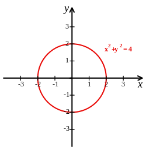

```{r setup, include=FALSE}
options(htmltools.dir.version = FALSE, htmltools.preserve.raw = FALSE)

knitr::opts_chunk$set(warning = FALSE, message = FALSE,echo=FALSE)
```


```{r xaringan, echo=FALSE}
xaringanExtra::use_xaringan_extra(c("tile_view","panelset","tachyons","scribble"))
```

```{css echo = FALSE}
.xe-scribble__tools.minimized {
  display: none;
}

.remark-slide-content {
  font-size: 28px;
  padding: 20px 80px 20px 80px;
}
.remark-code, .remark-inline-code {
  background: #f0f0f0;
}
.remark-code {
  font-size: 24px;
}
.huge .remark-code { /*Change made here*/
  font-size: 200% !important;
}
.tiny .remark-code { /*Change made here*/
  font-size: 50% !important;
}

.small{
font-size: 22px;
}

.mjx-chtml{ font-size: 100% !important; }

.small-math .mjx-chtml{ font-size: 85%; }
```

```{r echo=FALSE}
library(here)
library(tidyverse)
```

# Team Review

How did everyone feel about the problem set?

Anything still confusing?

Discuss with Team

---

# Disclaimer

Today is pretty concept heavy you might end up feeling like this:

```{r out.width="55%",fig.align='center'}
knitr::include_graphics("https://media.giphy.com/media/lXu72d4iKwqek/giphy.gif")
```

---
# Functions are like baking receipes

.pull-left[

- Assemble all your ingredients (independent variables like $x_1$, $x_2$)

- Follow the instructions to mix, bake, and decorate (Instructions of function)

- End up with final product (f(x))

Typically we use the notation $f(x)=x$, but we can always use different representations like $g(x)=x$ or $y=x$
]

.pull-right[
```{r out.withd"50%"}
knitr::include_graphics("img/cake.png")
```

]

---

# Properties of functions

For each combination of independent variables, there is exactly one value of the dependent variable.

- $f(1)\ne\{2,3\}$ i.e. if I put 1 into the function I can't have both 2 and 3 come out

- Vertical line test

Functions can be continuous or discontinuous

- Continuous: For every value of x, f(x) returns a number

- Discontinuous: Parts are undefined

---

# Are these functions?

.column-left[
```{r}
knitr::include_graphics("img/dsqrt.png")
```

]

.column-center[
```{r}
knitr::include_graphics("img/para.png")
```

]

.column-right[
```{r out.width="220%"}

```

]

---

.pull-left[
# Continuous

```{r}

```

Most function we deal with will be continuous
]

.pull-right[
#Discontinuous

```{r fig.align='center',out.width="70%"}
knitr::include_graphics("img/discont.png")
```

```{r fig.align='center',out.width="60%"}
knitr::include_graphics("img/tan.png")
```


]

---

# Limits

.bold[Definition:]

*The value a function approaches as the input approaches a specific value*

$$
\large
\lim_{x\to c} f(x)=L
$$
Verbally:

"The limit of the function f(x) as x approaches the value c is L"

---

# Start with an example

What is limit of $f(x)=2x^2-4$ as x approaches 2?

Strategy to solve: Evaluate f(x) at x that get closer and closer to 2

--

Quick sanity check, what should $f(2)=?$

--

$f(2)=4$

---

```{r fig.align='center',out.width="90%"}
knitr::include_graphics("img/lim4.png")
```

From both directions it looks like f(x) converges to 4

$$
\lim_{x\to c}(2x^2-4)=4
$$

---

# Graphical Solution

.pull-left[Finding limits of functions when f(x) is continuous at c is easy.

$$
\lim_{x\to c}f(x)=f(c)
$$
]

.pull-right[
```{r fig.align='center',out.width="100%"}
knitr::include_graphics("img/lim_graph_1.png")
```

]
---

# What happens with discontinuous functions?

Try with your group the same approach for:

$$
\lim_{x\to 2}f(x)=\frac{|x-2|}{x-2}
$$

Hint: Start very close to 2 like 1.9 and 2.1

--
```{r fig.align='center',out.width="90%"}
knitr::include_graphics("img/limx2.png")
```


---

# We broke the universe

Dividing by zero is impossible

The function approaches different values from either side

Therefore...

--

```{r fig.align='center',out.width="50%"}
knitr::include_graphics("img/limit.gif")
```

---

# Clearer on the graph

```{r fig.align='center',out.width="40%"}
knitr::include_graphics("img/lim_graph_2.png")
```

Technically the limit is "Undefined", because it does approach a finite value. Does not exist happens when the limits spiral off to infinity in both directions (tan graph)
---

# Defined Limit at an undefined point

Discontinuous functions can still have limits

Find the limit of $f(x)=x+1,x\ne 2$ as x approaches 2

--

```{r fig.align='center',out.width="50%"}
knitr::include_graphics("img/lim3.png")
```

.pull-left[
```{r fig.align='center',out.width="70%"}
knitr::include_graphics("img/lim_graph_3.png")
```
]

.pull-right[
x=2 may not exist, but we can still find a limit because it consistently approaches 3 from both directions
]

---
class: title-slide-section-blue, middle, center

# Team Assessment

---

Work with you team to complete these tasks Part 1:


1) Match the limit expression to the graph

.column-left[

A) 
```{r fig.align='center',out.width="50%"}
knitr::include_graphics("img/lim_g_a.png")
```


1) 

$$
\lim_{x\to3}g(x)=0
$$


]

.column-center[


B)
```{r fig.align='center',out.width="50%"}
knitr::include_graphics("img/lim_g_b.png")
```

2)

$$
\lim_{x\to-4}g(x)=3
$$
]

.column-right[

C)

```{r fig.align='center',out.width="50%"}
knitr::include_graphics("img/lim_g_c.png")
```


3)

$$
\lim_{x\to 3} g(x)= \text{DNE}
$$
]
---

Work with your team to complete these tasks Part 2:


2) Can you think of examples where discontinuous function might exist in environmental science? 

3) Choose as a team to draw an example of one of these statements

- $\lim_{x\to 4^-} f(x)$ and $\lim_{x\to 4^+}f(x)$ are both infinite

- $\lim_{x\to 3} f(x)=2$, but $f(3)=0$

- $\lim_{x\to 5^-} f(x)=4$ and $\lim_{x\to 5^+} f(x)=2$

- $\lim_{x\to -3} f(x)=-5$ but $f(-3)=-5$

---

class: title-slide-section-blue, middle, center

# Introduction to Derivatives

---

# Putting it all together

Recall average rate of change and instantaneous

```{r echo=FALSE,fig.align='center',out.width="50%"}
knitr::include_graphics("img/trex.png")
```

Taking the average rate of change to a set limit will eventually converge to the instantaneous. 

---

# Walk Through Example

```{r, fig.align='center'}
x=seq(0,3,by=0.01)
y=x^2

lim_df<-data.frame(x=x,y=y)

dx=2
y2=y[which(lim_df$x==dx)]

slope=y2/dx
line=x*slope


p0<-ggplot(data=lim_df,aes(x=x,y=y))+
  geom_line(color="black",linewidth=3)+
  theme_classic()+
  annotate("point",x=0,y=0,size=6,color="blue")+
  theme(text = element_text(size = 28)) 

p0

```


---

# Walk Through Example

```{r, fig.align='center'}
p1<-p0+
  geom_point(aes(x=dx,y=y2),color="blue",size=6)+
  geom_line(aes(x=x,y=line),color="red",linewidth=2)+
  annotate("text",x=1,y=7,label="Delta~x==2",parse=TRUE,size=14)+
  annotate("text",x=1,y=4.5,label="Slope=2",size=14)
p1

```
---

# Walk Through Example

```{r, fig.align='center'}
dx=1
y2=y[which(lim_df$x==dx)]

slope=y2/dx
line=x*slope
p2<-p0+
  geom_line(aes(x=x,y=line),color="red",linewidth=2)+
  geom_point(aes(x=dx,y=y2),color="blue",size=6)+
  annotate("text",x=1,y=7,label="Delta~x==1",parse=TRUE,size=14)+
  annotate("text",x=1,y=4.5,label="Slope=1",size=14)

p2

```

---

# Walk Through Example

```{r, fig.align='center'}
dx=0.5
y2=y[which(lim_df$x==dx)]

slope=y2/dx
line=x*slope
p3<-p0+
  geom_line(aes(x=x,y=line),color="red",linewidth=2)+
  geom_point(aes(x=dx,y=y2),color="blue",size=6)+
  annotate("text",x=1,y=7,label="Delta~x==0.5",parse=TRUE,size=14)+
  annotate("text",x=1,y=4.5,label="Slope=.25",size=14)
p3
```

---

# Walk Through Example

```{r, fig.align='center'}
dx=0.1
y2=y[which(lim_df$x==dx)]

slope=y2/dx
line=x*slope
p4<-p0+
  geom_line(aes(x=x,y=line),color="red",linewidth=2)+
  geom_point(aes(x=dx,y=y2),color="blue",size=6)+
  annotate("text",x=1,y=7,label="Delta~x==0.1",parse=TRUE,size=14)+
  annotate("text",x=1,y=4.5,label="Slope=.1",size=14)

p4

```

---

# Walk Through Example

```{r, fig.align='center'}
dx=0.01
y2=y[which(lim_df$x==dx)]

slope=y2/dx
line=x*slope
p5<-p0+
  geom_line(aes(x=x,y=line),color="red",linewidth=2)+
  geom_point(aes(x=dx,y=y2),color="blue",size=6)+
  annotate("text",x=1,y=7,label="Delta~x==0.01",parse=TRUE,size=14)+
  annotate("text",x=1,y=4.5,label="Slope=.01",size=14)

p5


```

---

# Tangent Lines

What if we set $\Delta x=0$? Then we would have a slope line that only touches at x=0.

```{r,fig.align='center'}
knitr::include_graphics("img/tangent_line.png")
```

These are tangent lines

---

# Put our example in math notation

$$\text{slope}=\frac{y_2-y_1}{x_2-x_1}$$

Choose a point along the function $(x,f(x))$

Choose a different point on the function $\Delta x$ away $(x+\Delta x,f(x+\Delta x))$

Add these into the slope equation

$$
\text{slope}=\frac{f(x+\Delta x)-f(x)}{(x+\Delta x) -x}=\frac{f(x+\Delta x)-f(x)}{\Delta x}
$$

---

# Derivative Definition

$$
\large
f'(x)=\lim_{\Delta x \to 0}=\frac{f(x+\Delta x)-f(x)}{\Delta x}
$$

.center[Most common notation]

$$
\large
f'(x)\text{, or }\frac{dy}{dx}
$$

---

# Not all functions are differentiable

.pull-left[

- All differentiable functions are continuous, but not all continuous functions are differentiable

- The absolute value function is one example $y=|x|$

]

.pull-right[

```{r, fig.align='center',out.width="90%"}
x=seq(-5,5)
y=abs(x)

df<-data.frame(x=x,y=y)

df %>% 
  ggplot(aes(x=x,y=y))+
  geom_vline(xintercept = 0)+
  geom_line(linewidth=3,color="red")+
  theme_classic()+
  theme(panel.border = element_blank(), axis.line.y = element_blank())+  
  scale_x_continuous(expand = c(0, 0))+
  scale_y_continuous(expand = c(0, 0))+
  theme(text = element_text(size = 28)) 
```

]

---

# Calculus and Derivatives are the study of change

```{r, fig.align='center',out.width="75%"}
knitr::include_graphics("img/loa.png")
```

---

# Rules for Differentiation

.center[.bold[Constant Rule]]

- If f is constant, then for all x, $f'(x)=0$

$$
\begin{align}
&y=a &\frac{dy}{dx}=0
\end{align}
$$
.center[.bold[Power Rule]]

$$
\frac{d}{dx}[x^n]
=nx^{n-1}
$$

---

# Examples

$$
\begin{align}
&y=100 & &y=5x^5 & &y=\frac{1}{x^2}
\end{align}
$$

---

# Rules for Differentiation

.center[Sum and Difference Rules]

$$
\begin{align}
\frac{d}{dx}&=[f(x)+g(x)]=f'(x)+g'(x) \\
\frac{d}{dx}&=[f(x)-g(x)]=f'(x)-g'(x)
\end{align}
$$

Looks really scary. All it says, if the function has pieces that are added or subtracted you can take the derivative of each individual piece.

---

# Example

$$
\begin{align}
&y=x^2+8x+4 & &y=x^3-x^2+x-15
\end{align}
$$

---
class: title-slide-section-blue, middle, center

# Team Assessment

---

1) As a team, list 5 fields of environmental science where studying the rate of change and derivatives would be important

2) Which rules should you use to take these derivatives?

$$
\begin{align}
\text{A)  }& f(x)=3x^4 &\text{B) }  y=4x^2+3x-16
\end{align}
$$

3) Find the derivatives of these functions

$$
\begin{align}
&\text{A) } y=3x^2 & &\text{B) }h(x)=y=7x+4 & &\text{C) }g(y)=\sqrt{y}
\end{align}
$$

4) Discuss why derivatives need continuity. It might help to think about why some continuous functions don't have derivatives.