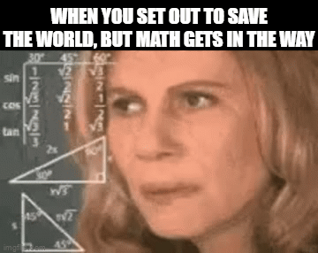
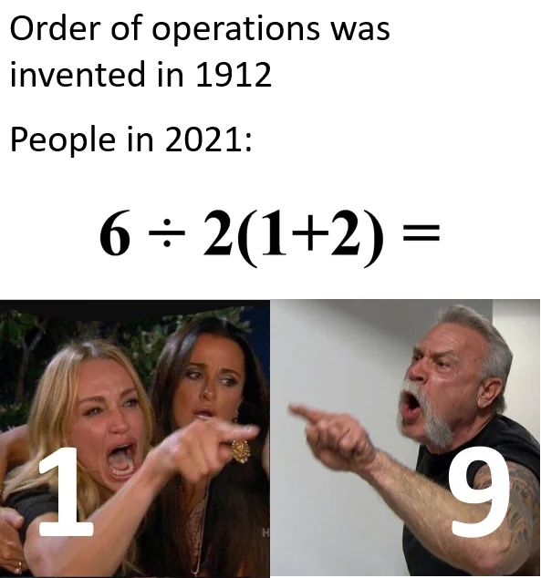
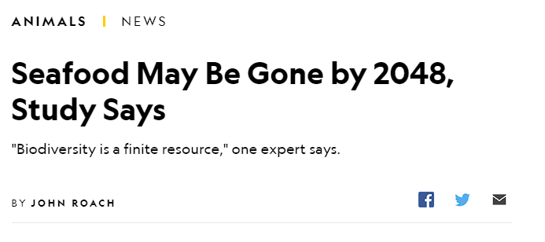
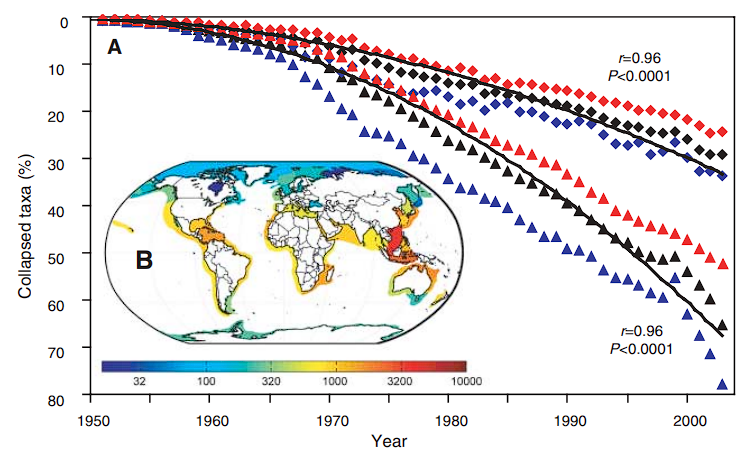
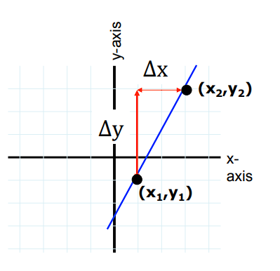
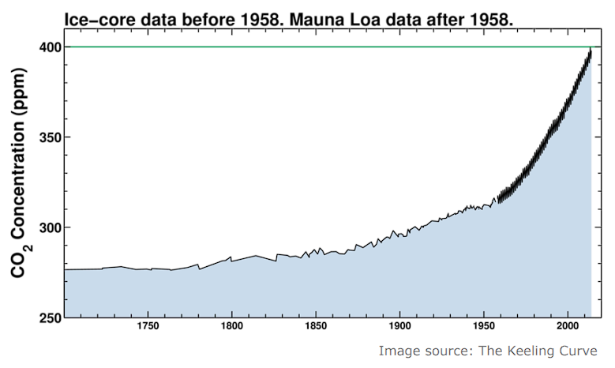
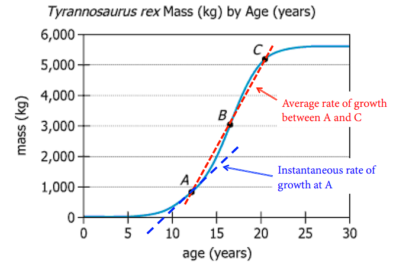

```{r setup, include=FALSE}
options(htmltools.dir.version = FALSE, htmltools.preserve.raw = FALSE)

knitr::opts_chunk$set(warning = FALSE, message = FALSE)
```


```{r xaringan, echo=FALSE}
xaringanExtra::use_xaringan_extra(c("tile_view","panelset","tachyons","scribble"))
```

```{css echo = FALSE}
.xe-scribble__tools.minimized {
  display: none;
}

.remark-slide-content {
  font-size: 28px;
  padding: 20px 80px 20px 80px;
}
.remark-code, .remark-inline-code {
  background: #f0f0f0;
}
.remark-code {
  font-size: 24px;
}
.huge .remark-code { /*Change made here*/
  font-size: 200% !important;
}
.tiny .remark-code { /*Change made here*/
  font-size: 50% !important;
}

.small{
font-size: 22px;
}

.mjx-chtml{ font-size: 100% !important; }

.small-math .mjx-chtml{ font-size: 85%; }
```

```{r echo=FALSE}
library(here)
library(tidyverse)
```


# Please fill out this survery

.center[]

[Or you can click on this link](https://forms.gle/BivhWDG7oaAefH6K6)

---

# Workshop Objectives

```{r,echo=FALSE,fig.align='center',out.width="30%"}

```

1. Shake off the math/schoolwork dust

2. Equip students with the math skills to succeed in all Bren Courses

3. Learn how valuable math is to environmental science

4. Build collaborative environment crucial at Bren


---

# We will be using Team-based learning 

- Science and policy are done collaboratively

- TBL shows better learning outcomes than traditional lecturing

  - [In Math](https://www.tandfonline.com/doi/pdf/10.1080/10511970.2018.1542417?casa_token=We71OsRHNuQAAAAA:U4I567tQynbXcFHplLpIkkamtpfUf1GqCgIKBP453cVdHJ8b3mP-yymXkVNOc4JJ4aZfJxpGvU766Q)
  
  - [For Women especially](https://www.tandfonline.com/doi/pdf/10.1080/00220485.2017.1397571?casa_token=d394sBXFFSEAAAAA:Sa68G6KKjBzxy6aD9KBnRH7W5xChBl_PYfy-Yeck2YlOCoDOxp903xu_6S9yTpFTwqVtugWK23im2Q)
  
  - [Higher engagement](https://www.lifescied.org/doi/pdf/10.1187/cbe.17-03-0055)
  
- We'll be doing a TBL Lite*, because I know orientation week is busy and school hasn't officially started

  - Keep extra pre-class work and assessments to a minimum
  
---
  
# Team formation

## Live coding demonstration


---

# Team expectations

## 1) Support and encourage each other

## 2) Communicate between all group members

## 3) Learn by teaching

## 4) Complete in class team assessments

### Out of class feel free to work with anyone in the class

---

class: title-slide-section-gold, middle, center

# Math in Environmental Science

---

# Describe to your team what is the purpose of environmental science?

# How would you go about solving environmental problems?

---

## Math is an important tool in Environmental Science

.pull-left[
.center[.bold[Math to investigate]]

Math is science's foundation for finding evidence

Math verifies positive statements 
  - (C02 concentrations increase by X amount for every Y amount of electricity used)
]

.pull-right[
.center[.bold[Math to communicate]]

Can only communicate what you understand

Policy people need to know how to support their arguments

Weaknesses in methods can be identified by understanding the mathematical foundation studies are built on 
]

---

# Math at Bren

.pull-left[
.center[.bold[In classes:]]

- ESM 201 Lokta-Volterra Models 
$$
\begin{align}
\frac{dN_1}{dt}&=r_1N_1\left(\frac{K_1-N_1-\alpha N_2}{K_1}\right)\\
\frac{dN_2}{dt}&=r_2N_2\left(\frac{K_2-N_2-\beta N_1}{K_2}\right)
\end{align}
$$

- ESM 222 Groundwater transport of absorbed contaminant
$$
\frac{\partial C}{\partial t}=\left(\frac{D}{R}\frac{\partial^2t}{\partial x^2}\right)-\left(\frac{v}{R}\frac{\partial C}{\partial x}\right)-\frac{k}{R}C
$$
]

.pull-right[
.center[.bold[In Research:]]

[Applying Portfolio Theory (A mix of calculus and stochastic linear algebra) to salmon stocks (MESM GP)](https://bren.ucsb.edu/projects/applying-portfolio-theory-improve-spatial-recovery-planning-pacific-salmon)

[We might be underestimating social cost of carbon because of adaptation (Dr. Jeon Bren PhD)](https://woongchanjeon.com/research/WJeon_JMP.pdf)

.gold[My own research in impacts from fishery insurance programs]

]

---
class: title-slide-section-blue, middle, center

# Algebra Review


---

# Rules of Algebra

1. Never change an equation, we rewrite into more useful forms

2. Manipulate BOTH sides of an equation with the SAME THING

3. Order of Operations (aka PEDMAS)

---

# (P)aranthesis (E)xponents (D)ivide (M)ultiply (A)dd (S)ubtract [PEDMAS]

.center[
```{r echo=FALSE, out.width="40%"}

```
]

---

# PEDMAS important for what order to manipulate equations

$$
4*(y-4)+(x+1)^2=z
$$
If I give you x and y, how would you solve this equation?

---

# Often times we want flexible equations 

Prices are important in economics, but not always available for environmental goods.

.center[.bold[How we get prices if we know quantity?]]

$$
\require{cancel}
\begin{aligned}
Q&=\frac{(400-P)}{80} &\text{Isolate P in terms of Q} \\
\end{aligned}
$$


---

# Often times we want flexible equations 

Prices are important in economics, but not always available for environmental goods.

.center[.bold[How we get prices if we know quantity?]]

$$
\require{cancel}
\begin{aligned}
Q&=\frac{(400-P)}{80} &\text{Isolate P in terms of Q} \\
80Q&=\frac{(400-P)\cancel{80}}{\cancel{80}}  &\text{ Multiply both sides by 80} \\
80Q-400&=\cancel{400}-\cancel{400} -P &\text{ Subtract both sides by 400} \\
-1(80Q-400)&=-P(-1) &\text{Multiply both sides by -1} \\
400-80Q&=P  &\text{Flip terms for simplicity}
\end{aligned}
$$


---

# It's easy to make mistakes while doing algebra. Practice makes perfect

Solve all in terms of x

$$
3x+2=10x-12
$$

$$
4-3(2x+1)=8-\frac{3x}{2}
$$
$$
3(x+7a)-5=b+2(c-4x)
$$
---

# Practice solutions
.pull-left[


$$
\small
\begin{aligned}
3x+2&=10x-12 \\
3x+2+12&=10x-12(+12) \\
3x-3x+14&=10x-3x \\
14&=7x \\
x&=2
\end{aligned}
$$
$$
\small
\begin{aligned}
4-3(2x+1)&=8-\frac{3x}{2}\\
4-3-6x&=8-\frac{3x}{2} \\
1-6x&=8-\frac{3x}{2} \\
2-12x&=16-3x \\
-9x&=14 \\
x&=\frac{-14}{9}\\
\end{aligned}
$$

]
.pull-right[

$$
\small
\begin{aligned}
3(x+7a)-5&=b+2(c-4x)\\
3x+21a-5&=b+2c-8x \\
11x+21a-5&=b+2c \\
11x&=5+b+2c-21a\\
x&=\frac{5+b+2c-21a}{11}
\end{aligned}
$$

]

---

# Exponents make algebra WAY tougher

.pull-left[

$x^n=x*x*x*x... (\text{n-times})$

Many environmental variables follow exponential formulas like decay and growth

You might find yourself trying to solve equations like $x^{\frac{3}{4}}=3x^{\frac{5}{3}}$

Use the same principles of algebra and the properties of the right to manipulate
]
.pull-right[
Properties and rules to help manipulate

$$
\begin{aligned}
x^0&=1 & x\ne0 \\
x^{-n}&=\frac{1}{x^n} &x\ne0 \\
(\sqrt[n]{x}=a)&\to x=a^n \\
x^\frac{1}{n}&=\sqrt[n]{x}\\
x^\frac{m}{n}&=(x^{\frac{1}{n}})^m=(\sqrt[n]{x})^m
\end{aligned}
$$
]
---
# Polynomials

$$
\large
\begin{align}
a_nx^n+a_{n-1}x^{n-1}+...+a_1x+a_0
\end{align}
$$

Really useful in fitting data in regressions

.big[.center[*Fundamental Theorem of Algebra:*]]

.big[.bold[Every nth degree polynomial has exactly n zeroes (solutions)]]

---
# Fundamental Theorem of Alegebra helps us solve for unknowns

Often times we look for solutions when equations equal zero

Interesting properties at zero or the difference between two equations

Comes from calculus maximization problems (covered in day 3)

---

# You were already finding zeroes!

This is just a 1st degree polynomial. How many solutions did it have?
$$
3x+2=10x-12
$$

Finding nth degree polynomials zeros are harder

Focus on 2nd degree polynomials


---
# (F)irst (O)utside (I)nside (L)ast [FOIL]

Second degree polynomials can be written as a multiplication of their "roots" aka solutions

$$
(x-4)(x+3)=0
$$

We can expand using FOIL!

--

### Multiply each term in the adjacent polynomial and add together

$$
\begin{align*}
\text{First}&=x*x & \text{Outside}&=3x & \text{Inside}&=-4x & \text{Last}&=-12 \\
x^2-&x-12=0 & &\text{Add all terms together}
\end{align*}
$$

---
# What do I mean by roots or solutions?


What happens if x=4 or x=-3 in $(x-4)(x+3)$

--

Try the same thing with $x^2-x-12$

--

The only way to get $x^2-x-12=0$ is for x to either be 4 or -3

--

4 and -3 are said the be the roots of the equation

---
# Quadratic Formula solves 2nd degree polynomials

.bold[For any second degree polynomial]

$$
ax^2+bx+c=0
$$

.bold[The solution to x=0 can be found using the quadratic formula]

$$
x=\frac{-b\pm\sqrt{b^2-4ac}}{2a}
$$
---
class: title-slide-section-blue, middle, center

# Team Assessment

---

1) Identify which numbers you should plug into which variable of the quadratic formula (e.g. a,b,c)

$$
4x^2+x-14=0
$$


2) Identify which numbers you should plug into which variable of the quadratic formula (e.g. a,b,c)


$$
256-\sqrt{44} x^2+.23x
$$

3) What happens if $b^2-4ac$ is negative?

4) Expand $(3x-6)(2x+1)$


---
# Solutions

$$
4x^2+x-14=0
$$


$$
\begin{aligned}
a=4 \\
b=1 \\
c=-14
\end{aligned}
$$

---

# Solution

$$
256-\sqrt{44} x^2+.23x
$$


$$
\begin{aligned}
a=\sqrt{44} \\
b=.23 \\
c=256
\end{aligned}
$$
.blue[This will probably be a nasty calculation, but that is what calculators and computers are for. The order does not matter, only that the a corresponds to the square term, the b to the 1st degree term, and the c to the constant]


---

# Solution

## 3) What happens if $b^2-4ac$ is negative in the quadratic formula?

.blue[There are no real solutions, but imaginary solutions. Can be useful (saddle path solutions, but that's for another class)]

---
# Solution

$$
\begin{align}
(3x-6)(2x+1) \\
6x^2+3x-12x-6 \\
6x^2-9x-6
\end{align}
$$

---
class: title-slide-section-blue, middle, center

# Graphs

---
# Graphing brings visual connection to math

.center[.bold[Which looks better and is easier to understand?]]
.pull-left[
.tiny[
```{r echo=FALSE}
library(DT)

car<-mtcars %>% 
  select(mpg,cyl,disp,hp)
DT::datatable(car,
              fillContainer = FALSE, options = list(pageLength = 4))
```
]

]

.pull-right[
.tiny[
```{r,echo=FALSE,out.width="90%"}
ggplot(mtcars, aes(x=as.factor(cyl), y=mpg)) + 
    geom_boxplot(fill="slateblue", alpha=0.2) + 
    xlab("Number of Cylinders")+
  theme_classic()+
  theme(text = element_text(size = 28)) 
```
]
]

---

# How to use graphs

.pull-left[
Graphs move in a rectangular coordinate system with two dimensions (axes)

- x - axis (horizontal)

- y- axis (vertical)

- Axis units must be defined

We use point pairs to place data

- (.bold[X],.bold[Y])

- Where would (2,-1) go on the graph?
]

.pull-right[
```{r echo=FALSE}
knitr::include_graphics("img/cart.png")
```

]

---

# Graph series of points to make lines

.pull-left[
```{r echo=FALSE}
set.seed(1)
x=seq(0,10)
y=x+1.5*rnorm(10)
pdf<-data.frame(x=x,y=y)

DT::datatable(round(pdf,2),
              fillContainer = FALSE, options = list(pageLength = 6))
```
]

.pull-right[
```{r, echo=FALSE}
ggplot(pdf,aes(x=x,y=y))+
  geom_point(size=4)+
  geom_path(linewidth=2)+
  geom_smooth(method="lm",se=FALSE,size=2)+
  annotate("text",x=2.8,y=8,label="Blue Regression Line\ny=0.856x+0.44",size=8)+
  theme_classic()+
  theme(text = element_text(size = 28)) 
```

]

---

# Most functions can be shown on graphs

.pull-left[

- $\color{green}{y=sin(3x+2)}$

- $\color{red}{y=0.5x^3+x^2-5x+2}$

- $\color{blue}{y=0.85x+0.44}$
]

.pull-right[

```{r echo=FALSE}

x=seq(0,10,by=0.01)
sn=sin(3*x)+2*x
pol=-0.2*x^3+2*x^2-2*x+2
reg=x*0.85+0.44

p2df=data.frame(sin=sn,polynomial=pol,linear=reg,x=x) %>% 
  pivot_longer(cols=!x,values_to="values",names_to = "fun")
```


```{r echo=FALSE, fig.align='center'}
p1<-ggplot(p2df,aes(x=x,y=values,color=fun))+
  geom_path(linewidth=3)+
  theme_classic()+
  scale_color_manual(values=c("blue","red","darkgreen"),name="Function Type")+
  labs(y="y")+
  theme(text = element_text(size = 28)) +
  geom_hline(yintercept=0,color="black",size=1.5)+
  scale_x_continuous(expand = c(0, 0)) +
  scale_y_continuous(expand = c(0, 0))
  
p1
  
```

]

---

# Two key ingredients to graphs

.pull-left[

1) Intercepts

- X-intercept

  - Where does the graph intersect the x-axis? (x,0)
    
- y-intercept

    - Where does  the graph intersect the y-axis? (0,y)
    
2) Slope of lines

- How quickly is the graph changing?

]

.pull-right[
.center[What are the intercepts of the polynomial function in red?]

```{r echo=FALSE,fig.align='center',out.width="80%"}
p1+theme(legend.position = "none")
  
```

]

---

```{r echo=FALSE,fig.align='center',out.width="50%"}

```

--

```{r echo=FALSE,fig.align='center',out.width="59%"}

```
---

# Slope-Intercept Form

Easiest model to describe linear relationship between two variables

$$
\huge
\begin{align}
\underbrace{y}_{\text{y-variable}}=\overbrace{m}^{\text{Slope}}\underbrace{x}_{\text{x-variable}}+\overbrace{b}^{\text{y intercept}}
\end{align}
$$

---

# Definition of Slope

.pull-left[
Vertical Change per unit of Horizontal Change

$$
m=\frac{\Delta y}{\Delta x}=\frac{y_2-y_1}{x_2-x_1}
$$

Horizontal Slope: m=0

Vertical Slope: m is undefined

]

.pull-right[

.bold[Rise over Run]

```{r echo=FALSE,fig.align='center',out.width="80%"}

```

]

---

# Slope represents rate of change 

```{r echo=FALSE,fig.align='center',out.width="80%"}

```


---

# Slope can be *average* or *instantaneous*

.pull-left[
Rise over run can always be used to find average rate of change between two parts of a graph


]

.pull-right[
Instantaneous leads us to Calculus

]

```{r echo=FALSE,fig.align='center',out.width="50%"}

```

---
class: title-slide-section-blue, middle, center

# Team Assessment

---
class: small

You're team measured the concentrations of pesticides in a lake exposed to agricultural runoff. The intern in charge of finishing the calculations ran off for the weekend leaving you all to finish their work. They left behind the following equation describing the total amount of pesticides in the lake if runoff is stopped from the farm by a new policy incentive reducing pesticides use:

$$
\begin{aligned}
&y=(8-2t)(t+2) \\
&\text{Where } y \text{ is pesticde concentration in ppb} \\
&\text{and } t \text{ is time in years}
\end{aligned}
$$

.small[Work with your team to discuss conceptually how you would solve the following tasks.

1) Write out the intern's work in a more useful equation

2) How long will it take for the pesticide concentration in the lake to reach zero? Since the equation is a polynomial describe why one solution is more applicable than the other.

3) Present your findings (Choose between a graph or table)

4) What is the average change in concentration from year 0 to year 4?

5) Explain to your client why concentrations might behave the way they were modeled.
]

---

# Solutions

## 1) Solution

Let's FOIL out the equation so it becomes easier to graph.

$$
\begin{aligned}
y&=(-2t+8)(t+2) \\
y&=\overbrace{-2t^2}^{\text{First}}-\overbrace{4t}^{\text{Outside}}+\overbrace{8t}^{\text{Inside}}+\overbrace{16}^{\text{Last}}\\
y&=-2t^2+4t+16
\end{aligned}
$$
---

## 2) Solution

Two possible ways to answer:

.pull-left[.center[Use the Quadratic Formula]

$$
\begin{aligned}
0&=-2t^2+4t+16 \\
0&=\frac{-4\pm\sqrt{4^2-4(-2)(16)}}{2(-2)}\\
0&=\frac{-4\pm\sqrt{16+128}}{-4} \\
&t=4\text{, } t=-2
\end{aligned}
$$
]

.pull-right[
.center[Use the factors]
$$
\begin{aligned}
2t-8=0 \\
t=\frac{8}{2}\\
t=4
\end{aligned}
$$

$$
\begin{aligned}
t+2=0 \\
t=-2
\end{aligned}
$$

]
---

## 3) Solution

.pull-left[

```{r, echo=FALSE,out.width="90%"}
t=seq(-2,4)
y=-2*t^2+4*t+16
df<-data.frame(t=t,y=y)
p<-df %>% 
  ggplot(aes(x=t,y=y))+
  geom_line(color="#003660",linewidth=3)+
  labs(x="Years",y="Pesticide Concentration")+
  scale_x_continuous(expand = c(0, 0)) +
  scale_y_continuous(expand = c(0, 0))+
  theme_classic()+
  theme(text = element_text(size = 28)) 

p
```
]

.pull-right[
 .tiny[
```{r eval=FALSE}
t=seq(-2,4)
y=-2*t^2+4*t+16
df<-data.frame(t=t,y=y)
p<-df %>% 
  ggplot(aes(x=t,y=y))+
  geom_line(color="#003660",linewidth=3)+
  labs(x="Years",y="Pesticide Concentration")+
  scale_x_continuous(expand = c(0, 0)) +
  scale_y_continuous(expand = c(0, 0))+
  theme_classic()+
  theme(text = element_text(size = 28)) 

p
```
 
 ]
]
---

## 4) Solution

.pull-left[
```{r echo=FALSE}
p2<-df %>% 
  filter(t>=0) %>% 
  ggplot(aes(x=t,y=y))+
  geom_line(color="#003660",linewidth=3)+
  labs(x="Years",y="Pesticide Concentration")+
  scale_x_continuous(expand = c(0, 0)) +
  scale_y_continuous(expand = c(0, 0))+
  annotate("segment",x=0,xend=4,y=16,yend=0,color="#FEBC11",linewidth=2)+
  theme_classic()+
  theme(text = element_text(size = 28)) 

p2
```

]


.pull-right[
.tiny[
```{r eval=FALSE}
p2<-df %>% 
  filter(t>=0) %>% 
  ggplot(aes(x=t,y=y))+
  geom_line(color="#003660",linewidth=3)+
  labs(x="Years",y="Pesticide Concentration")+
  scale_x_continuous(expand = c(0, 0)) +
  scale_y_continuous(expand = c(0, 0))+
  annotate("segment",x=0,xend=4,y=16,yend=0,color="#FEBC11",linewidth=2)+
  theme_classic()+
  theme(text = element_text(size = 28)) 

```
Use rise over run:

$$
\frac{\Delta y}{\Delta x}=\frac{0-16}{4-0}=-4
$$
Pesticides are removed from the lake at an average rate of 4 ppb per year

]]


---

## 5) Solution

.pull-left[

```{r echo=FALSE}
p2
```
]

.pull-right[
Pesticide concentrations might initially increase in the lake from residual particles in the soil being washed into the lake. Then a mixture microbial activity and other chemical process reduce the pesticides to more inert components (You will learn the actual answer in ESM 202)
]