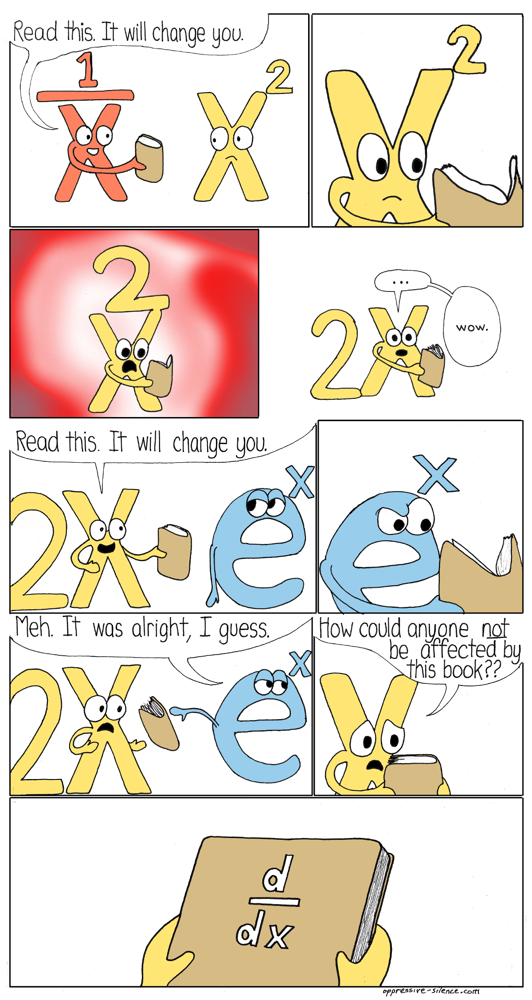
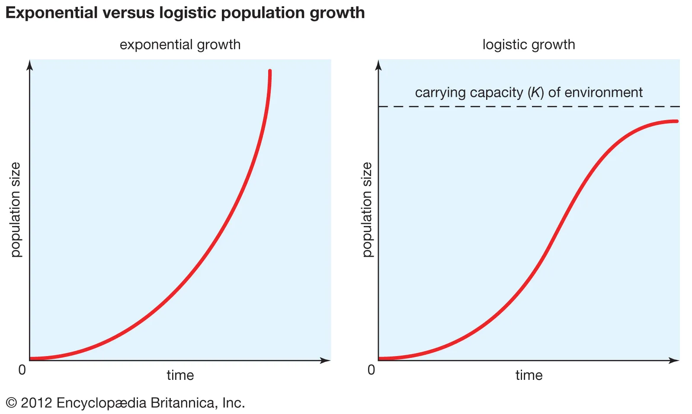

```{r setup, include=FALSE}
options(htmltools.dir.version = FALSE, htmltools.preserve.raw = FALSE)

knitr::opts_chunk$set(warning = FALSE, message = FALSE,echo=FALSE)
```


```{r xaringan, echo=FALSE}
xaringanExtra::use_xaringan_extra(c("tile_view","panelset","tachyons","scribble"))
```

```{css echo = FALSE}
.xe-scribble__tools.minimized {
  display: none;
}

.remark-slide-content {
  font-size: 28px;
  padding: 20px 80px 20px 80px;
}
.remark-code, .remark-inline-code {
  background: #f0f0f0;
}
.remark-code {
  font-size: 24px;
}
.huge .remark-code { /*Change made here*/
  font-size: 200% !important;
}
.tiny .remark-code { /*Change made here*/
  font-size: 50% !important;
}

.small{
font-size: 22px;
}

.mjx-chtml{ font-size: 100% !important; }

.small-math .mjx-chtml{ font-size: 85%; }
```

```{r echo=FALSE}
library(here)
library(tidyverse)
```


# Team Review

How did everyone feel about the problem set?

Anything remaining confusing?

Discuss with Team


---

# Rules for Derivatives Continued

.center[.bold[Product Rule]]

$$
\large
\frac{d}{dx}=[f(x)*g(x)]=f(x)g'(x)+g(x)f'(x)
$$

Breakdown multiplication into two separate functions

Then keep the first times the derivative of the second and add the derivative of the first times the derivative of the second

---

# Product Rule Example

$$
\begin{align}
y&=2x(x^2+3x) \\
y&=\overbrace{2x}^{f(x)}\overbrace{(x^2+3x)}^{g(x)} &\text{Break into two functions} \\
\frac{dy}{dx}&=\overbrace{2x}^{f(x)}\overbrace{(2x+3)}^{g'(x)}+\overbrace{2}^{f'(x)}\overbrace{(x^2+3x)}^{g(x)} &\text{Apply Power Rule} \\
\frac{dy}{dx}&=6x^2+12x  &\text{Algebra clean up}
\end{align}
$$

---

# Rules for Derivatives

.center[.bold[Quotient Rule]]

$$
\large
\frac{d}{dx}\left [\frac{f(x)}{g(x)}\right]=\frac{g(x)f'(x)-f(x)g'(x)}{[g(x)]^2}
$$

Same idea as product rule, but order matters

The denominator has to be $g(x)$

---

# Quotient Rule Example

$$
\small
\begin{align}
y&=\frac{x^2}{(x+1)} \\
y&=\frac{\overbrace{x^2}^{f(x)}}{\underbrace{(x+1)}_{g(x)}} &\text{Identify function}\\
\frac{dy}{dx}&=\frac{\overbrace{(x+1)}^{g(x)}\overbrace{2x}^{f'(x)}-\overbrace{x^2}^{f(x)}\overbrace{(1)}^{g'(x)}}{\underbrace{(x+1)^2}_{[g(x)]^2}} &\text{Quotient Rule} \\
\frac{dy}{dx}&=\frac{x^2+2x}{(x+1)^2}
\end{align}
$$

.bold[Note:] Algebraically solving Quotient Rules can be very challenging. Try to reduce it down to a useable form.

---

# Rules of Derivatives continued

.center[.bold[Chain Rule]]

$$
\large
\frac{d}{dx}[f(g(x))]=f'(g(x))g'(x)
$$

Take the derivative of the outermost function then multiply by the derivative of the innermost

Probably the most important rule for advanced calculus

---

# Chain Rule Example

Use a trick called u-substituion

Label the inner function as u

Take the derivative with respect to u

$$
\begin{align}
y&=(x^3-2)^2\\
g(x)&=u=x^3-2 &f(x)=u^2 \\
\frac{d}{dx}(x^3-2)&=\frac{dy}{du}\cdot\frac{du}{dx}=\frac{d}{du}(u^2)\cdot\frac{d}{dx}(x^3-2)
\end{align}
$$
---

# Chain Rule Example Continued

$$
\begin{align}
\frac{d}{dx}(x^3-2)&=\frac{d}{du}(u^2)\cdot\frac{d}{dx}(x^3-2)\\
\frac{d}{du}(u^2)=&2u  &\text{First Term}\\
\frac{d}{dx}(x^3-2)&=3x^2 &\text{Second term}\\
\frac{dy}{dx}&=2u\cdot3x^2 &\text{Total Solution} \\
\frac{dy}{dx}&=2(x^3-2)(3x^2)  &\text{Sub } u=x^3-2\text{ back in}
\end{align}
$$

---

# An aside on exponents

Base $e$ exponents are unique and useful in many math applications

Originally derived to solve compounding interest rates problems in 1683 by Bernoulli


.pull-left[
It's a constant $e\approx 2.72$

Comes from this limit 
]

.pull-right[
Follows normal power properties

$e^{x+y}=e^x\cdot e^y$

$e^{-x}=\frac{1}{e^x}$

$e^{x-y}=\frac{e^x}{e^y}$

$e^{rx}=(e^x)^r$
]


---

# Derivatives of Exponents

$$
\large
\frac{d}{dx}e^x=e^x
$$
.pull-left[
```{r,fig.align='center',out.width="35%"}
x=seq(-1,1,by=0.01)
y=exp(x)

ggplot()+
  geom_line(aes(x=x,y=y),color="black",linewidth=3)+
  theme_classic()+
  labs(x="",y="",title=bquote(e^x))+
  theme(text=element_text(size=28))
```
]

.pull-right[The derivative at every point on this line is simply f(x) 

When x=0, $\frac{d}{dx(0)}=1]

---

# Derivatives of Exponents

```{r,fig.align='center',out.width="25%"}

```


---

# Higher Order Derivatives

- We can continue to take derivatives of derivatives

- The second derivative becomes the rate of change of the rate of change (Think acceleration)

- Notation: 

    - $f''(x)$ or $\frac{d^2y}{dx^2}$: 2nd Derivative
    
    - $f^{(n)}(x)$ or $\frac{d^ny}{dx^n}$ nth derivative

---

```{r,fig.align='center',out.width="75%"}
knitr::include_graphics("img/nth.png")
```


---
class: title-slide-section-blue, middle, center

# Team Assessment

---

# Identify which rule works best for each function.

$$
\begin{align}
\text{A) }y=e^{\sqrt{3x+10}} & &\text{B)  }g(y)=\frac{(8y+2)}{(4y+3)^3}  &  & \text{C) }p(b)=18x\cdot e^{2x}
\end{align}
$$

.footnote[Assessment continues on next slide]
---

1) Find the first derivative
$$
f(x)=(2x-x^2)^3
$$
2) Find the first derivative

$$
f(x)=\frac{2}{x^2+1}
$$

3) Find the third derivative

$$
f(x)=x^2(2x+1)
$$


---
class: title-slide-section-blue, middle, center

# Applications of Derivaties

---

# Exponential functions in the world

[Infectious diseases](https://ourworldindata.org/covid-cases?country=~USA)

[Human population](https://ourworldindata.org/grapher/population)

[Communication](https://ourworldindata.org/grapher/ict-adoption)

[Growth of Renewable Energy](https://ourworldindata.org/grapher/modern-renewable-prod)

---

# Logistic Growth

Resource limits do exist in the world

$$
\begin{align}
\frac{dN}{dt}&=rN\left(\frac{K-N}{K}\right) \\
\text{Where }N=\text{population, }r=\text{growth rate, }&t=\text{time, and }K=\text{Carrying Capacity}
\end{align}
$$

```{r,fig.align='center',out.width="50%"}

```


---

# Extremely important in Fisheries and Biological Conservation

.pull-left[
```{r,fig.align='center'}
x=seq(0,50)
logistic<-function(t,p,k,r){
 out= p*k*exp(r*t)/((k-p)+p*exp(r*t))
 
 return(out)
}

y=logistic(t=x,p=10,k=100,r=.15)

sec_log<-function(t,p,k,r){
  r*p*k*(k-p)*exp(r*t)/((k-p)+p*exp(r*t))^2
}

z=sec_log(t=x,p=10,k=100,r=.15)
p1<-ggplot()+
  geom_line(aes(x=x,y=y),linewidth=2)+
  theme_classic()+
  labs(y="Population",x="Time",title="Logistic Growth")+
  geom_hline(yintercept=100,color="red",linewidth=2,linetype=2)+
  annotate("text",label="Carrying Capacity",x=25,y=122,size=14)+
    annotate("segment",x=25,xend=25,y=115,yend=101,color="red",size=2,arrow=arrow())+
  theme(text = element_text(size = 28))+
  ylim(0,130)

p2<-ggplot()+
  geom_line(aes(x=x,y=z),linewidth=2)+
  theme_classic()+
  labs(y="Rate of Population Growth",x="Time",title="Derivative of Logistic")+
  annotate("segment",x=29,xend=16,y=3.2,yend=3.8,size=2,arrow=arrow())+
  annotate("text",label="Maximum\nSustainable\n Yield",x=40,y=3.1,size=14)+
  theme(text = element_text(size = 28)) 

p1

```
]

.pull-right[

```{r,fig.align='center'}
p2
```
]
---

# Application of derivatives allows us to find crucial information to solve environmental problems

1) Find instantaneous rate of change at any point

2) Find when functions are increasing or decreasing

3) Find the Optimal values of functions

    - Optimal values are key to designing effective policies

---

# How quickly is the human population rising right now?

Dochy et al. (1995) used the following function to describe the increase in human population over time:

$$
x(t)=\frac{1}{c-\beta t}
$$

Where $c=9.833*10^{-3}$, $\beta=4.849*10^{-6}$, and $x$ is the total human population in millions at year $t$.

How quickly was the human population increasing in 1450?

How fast does this model predict human growth rate should be today in 2023?

---
# Begin by taking the derivative

First think of which rules we would for $x(t)=\frac{1}{c-\beta t}$

---

# Begin by taking the derivative

First think of which rules we would for $x(t)=\frac{1}{c-\beta t}$

$$
\begin{align}
x(t)&=\frac{1}{c-\beta t} \\
x(t)&=(c-\beta t)^-1 &\text{Rearrange} \\
\frac{dx}{dt}&=\beta(c-\beta t)^{-2} &\text{Chain and Power Rule}\\
x'(1450)&=.61 \text{ million per year} &x'(2023)=8,800
\text{ million per year}
\end{align}
$$
--

Why is this model so wrong?

---
# It isn't wrong, but not predictive out of sample
.pull-left[
```{r,fig.align='center',fig.cap="Figure 2 from Dochy 2015",out.width="85%"}
knitr::include_graphics("img/dochy.png")
```

]

.pull-right[
<iframe src="https://ourworldindata.org/grapher/population-regions-with-projections" loading="lazy" style="width: 100%; height: 550px; border: 0px none;"></iframe>
]

---

# Derivatives help understand the behavior of functions

Useful in designing predictive theory for new policies

Personal Example: Will a fishery insurance program incentivize overfishing?

$$
\begin{align}
\begin{bmatrix}\frac{\partial K}{\partial \gamma} \\ \frac{\partial L}{\partial \gamma}\end{bmatrix}
=-\begin{bmatrix}
\frac{\partial U}{\partial K \partial K} & \frac{\partial U}{\partial K \partial L} \\
\frac{\partial U}{\partial L \partial K} & \frac{\partial U}{\partial L \partial L}\end{bmatrix}^{-1}\begin{bmatrix}\frac{\partial U}{\partial K \partial \gamma}\\ \frac{\partial U}{\partial L \partial \gamma}\end{bmatrix}
\end{align}
$$

What conditions lead to:

$$
\begin{align}
\begin{bmatrix}\frac{\partial K}{\partial \gamma} \\ \frac{\partial L}{\partial \gamma}\end{bmatrix}\lesseqgtr 0
\end{align}
$$

---

# Let's start a little simpler

.bold[Definition of increasing and decreasing Intervals of a Function]

- For the function f (differentiable on the interval $(a,b)$)

    - If $f'(x)>0$ for all x values between a and b, this interval is increasing
    
    - If $f'(x)<0$ for all x values betwen a and b, this interval is said to be decreasing
    
    - If $f'(x)=0$ for all values between a and b, then the function is constant within the interval
    
---

# Graphical demonstration of Increasing vs Decreasing

```{r,fig.align='center',out.width="80%"}
knitr::include_graphics("img/increase.png")
```

Helps us find maximums or minimums
---

# Optimization problems find relative extremum (aka max or min) of functions

1) Find First Order Conditions:

- Relative extremum exist at all points on function where $f'(x)=0$

2) Verify Second Order Conditions:

- Whether an extremum is a maximum or minimum requires us to test if it is increasing or decreasing at the extremum

- $f(x^*)$ is a local maximum if $f''(x)<0$

- $f(x^*)$ is a local minimum if $f''(x)>0$

---

# Graphical Example 

.pull-left[
$f(x)=x^3-12x+2$

Where does $f'(x)=0$
]


.pull-right[

```{r fig.align='center'}

x=seq(-5,5,by=.1)
y=x^3-12*x+2

ggplot()+
  geom_line(aes(x=x,y=y),size=2.5,color="#003660")+
  theme_classic()+
  annotate("text",x=-2,y=35,label="Local Maximum",size=13)+
  annotate("text",x=2,y=-35,label="Local Minimum",size=13)+
  annotate("segment",x=0.5,xend=4,y=-14,yend=-14,linetype=2,color="#FEBC11",size=2)+
  annotate("segment",x=-.5,xend=-4,y=18,yend=18,linetype="dashed",color="#FEBC11",size=2)+
  theme(text = element_text(size = 28)) 

```
]

---

# Solve analytically

First Order Conditions:

$$
\begin{align}
f(x)&=x^3-12x+2 \\
f'(x)&=3x^2-12 \\
x^*&=-2  & x^*=-2
\end{align}
$$

Second Order Conditions:

$$
\begin{align}
f''(x)&=6x \\
f''(-2)&<0  &f''(2)>0
\end{align}
$$

By the first order conditions we know that $x=2$ and $x=-2$ are local optimum.

The second order conditions inform us that $x=-2$ is a local maximum and $x=2$ is a local minimum.

---
class: title-slide-section-blue, middle, center

# Team Assessment

---

1) How many local min and maximums can you find on this graph?

```{r,fig.align='center'}
x=seq(-1,2.75,by=0.01)

y=2*x^6-13*x^5+26*x^4-7*x^3-28*x^2+20*x

ggplot()+
  geom_line(aes(x=x,y=y),color="#003660",size=3)+
  theme_classic()+
  theme(text = element_text(size = 28)) 
  

```

.footnote[Assessment continues on next slide]
---

2) Solve for all optimum. Identify which are minima and which are maxima.

$$
f(x)=2x^3-6x^2+3x+15
$$

.footnote[Assessment continues on next slide]
---

3) Your team has been hired to help the city of Santa Barbara to help eliminate a nasty pollutant in our streams. You are choosing between two policies. Policy A provides $\sqrt{10x+4}$ benefits where $x$ is the dollar spent on interventions. Policy B provides $\sqrt{20x+4}$ benefits for every dollar spent. However, each policy has a cost associated with each. Policy A has a constant linear cost at $2x$ and Policy B has a constant linear cost at $3x$.

1) Find the optimal amount of interventions dollars to spend for each policy. Consider both costs and benefits. [hint: Remember $\sqrt{}$ is just $x^{\frac{1}{2}}$. You can use exponent rules to help solve]

2) Which policy provides the most benefits?

3) Which policy is cheaper?

4) Which policy should the city of Santa Barbara pursue?
