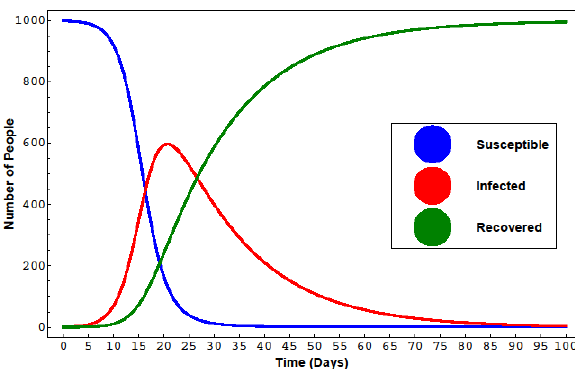
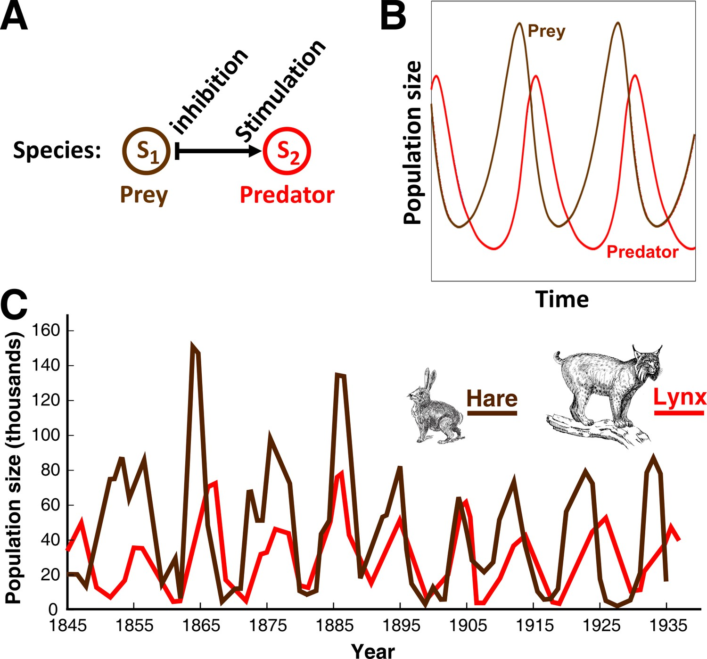
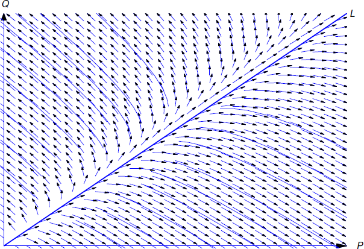

```{r setup, include=FALSE}
options(htmltools.dir.version = FALSE, htmltools.preserve.raw = FALSE)

knitr::opts_chunk$set(warning = FALSE, message = FALSE,echo=FALSE,fig.align = 'center')
```


```{r xaringan, echo=FALSE}
xaringanExtra::use_xaringan_extra(c("tile_view","panelset","tachyons","scribble","use_clipboard"))
xaringanExtra::use_clipboard()
```

```{css echo = FALSE}
.xe-scribble__tools.minimized {
  display: none;
}

.remark-slide-content {
  font-size: 28px;
  padding: 20px 80px 20px 80px;
}
.remark-code, .remark-inline-code {
  background: #f0f0f0;
}
.remark-code {
  font-size: 24px;
}
.huge .remark-code { /*Change made here*/
  font-size: 200% !important;
}
.tiny .remark-code { /*Change made here*/
  font-size: 50% !important;
}

.small{
font-size: 22px;
}

.mjx-chtml{ font-size: 100% !important; }

.small-math .mjx-chtml{ font-size: 85%; }
```

```{r echo=FALSE}
library(here)
library(tidyverse)
```


# Team Review

How did everyone feel about the problem set?

Anything remaining confusing?

Discuss with Team


---

# Exponents and natural log rules in Integration

$$
\large
\int e^xdx=e^x+C
$$

If the x term gets more complex, we need integration by parts or substiution. Neither we will cover

$$
\large
\int \frac{1}{x}=\ln x+C
$$

$$
\begin{align}
\int \ln x&=x\ln x-x+C  
\end{align}
$$
This is solved by integration by parts

---

# How do we solve? 

$$
\large
\frac{dy}{dx}=4y
$$

What are taking the intergral with respect too?

What do we do with the 4y?

What about the dy?

---

# Differential Equations help us understand changing environments

Variables often change with each other and effects over time are extremely important

```{r,out.width="60%"}

```


---

# We'll focus on separable first order, ordinary differential equations

*Separable* - Break apart the function into an independent and dependent side

$$
N(y)dy=M(x)dx
$$

*First Order* - Only looking at first derivative rate of changes

$$
\text{Only } \frac{dy}{dx}\text{ , no }\frac{d^2y}{dx^2}
$$

*Ordinary* - We only have one independent variable

---

# Steps for solving an Ordinary Differential Equation (ODE)

1. Move like terms to the same side, including differentials (dx,dy)

2. Apply the integral to both sides

3. Rearrange equations to isolate in terms of dependent variable

4. Use initial conditions (if given) to find C values

5. Evaluate the bounds if definite intervals are given


---

# Start small

$$
\frac{dy}{dx}=4y
$$

--

$$
\frac{dy}{4y}=dx
$$

--

$$
\begin{align}
\int\frac{dy}{4y}&=\int dx\\
\frac{1}{4}\ln y&=x+C_1 \\
\ln y&=4x+C_2\\
y&=e^{4x+C_2} \\
y&=e^{C_2}e^{4x} \\
y&=Ce^{4x}
\end{align}
$$

---

# Go big with Lotka-Voltera

```{r,out.width="55%"}

```

---

# One predator and one prey species

.pull-left[
.center[.bold[Prey Species]]

$$
\frac{dx}{dt}=\alpha x-\beta xy
$$

$x$ is the prey population

$t$ is time

$\alpha$ is the prey growth rate

$\beta$ is the effect of predators on the prey's growth rate
]

.pull-right[
.center[.bold[Predator Species]]

$$
\frac{dy}{dt}=\delta x y-\gamma y
$$

Where $y$ is the population of the predator

$\delta$ is the effect of prey on predators growth rate

$\gamma$ is the predator per capita death rate
]

---

# Combine both equations by eliminating time


$$
\begin{align}
\frac{dx}{\alpha x-\beta x y}&=dt &\text{Solve for dt}\\
\frac{dy(\alpha x-\beta x y)}{dx}&=\delta x y-\gamma y &\text{Sub in dt}\\
\frac{dy}{dx}&=\frac{\delta x y-\gamma y}{\alpha x-\beta x y}\\
\frac{dy}{dx}&=-\frac{y}{x}\frac{\delta x-\gamma}{\beta y-\alpha} &\text{Pull out x and y}
\end{align}
$$

What does this model tells us?

---
# Set up Diff eq steps

1) Separate equations

$$
\begin{align}
\frac{dy}{dx}&=-\frac{y}{x}\frac{\delta x-\gamma}{\beta y-\alpha}\\
\frac{dy(\beta y-\alpha)}{y}&=-\frac{(\delta x-\gamma)dx}{x}
\end{align}
$$

---

# Diff eq steps

2) Apply integral

$$
\begin{align}
\int\frac{dy(\beta y-\alpha)}{y}&=-\int\frac{(\delta x-\gamma)dx}{x} \\
\int\beta dy-\int\frac{\alpha}{y}dy&=\int\frac{\gamma}{x}dx-\int\gamma dx &\text{Distribute terms}\\
\beta y-\alpha \ln y&=\delta \ln x-\gamma x +V
\end{align}
$$

From here we could find intital conditions that lead to a changing population

---

# Just because we solved it does not make it any easier to understand

```{r,out.width="60%"}

```


---
class: highlight-last-item

# We need computers to solve and visualize many Diff Eqs

- Lotka-Volterra and other dynamic population differential equation models will make appearances in ESM 201

--

- Rate of pollutant concentrations in ESM 202

--

- Solar forcing equations in ESM 203

--

- and many more in your time at Bren!

---
class: title-slide-section-blue, middle, center

# Team Assessment

---

An oil spill of the coast of Santa Barbara is spreading rapidly. Previous spills and an analysis of the current indicate that the oil is spreading at a daily rate of:

$$
\frac{dA}{dt}=-0.001A+60
$$
If after the first day the oil has spread to 25 $km^2$, find an equation to show the spread of oil in total area.

When will the oil spill cover all of the Santa Barbara Channel (~5850 $km^2$)?

Hint:(The integral of $\frac{1}{ax+b}=\frac{ln(ax+b)}{a}$ Think reverse chain rule)


---
class: title-slide-section-blue, middle, center

# Numerical Calculus

---

# Functions in R

Like functions in math, R functions are like baking recipes

```{r,eval=FALSE,echo=TRUE}

#cake       #recipe name (Ingredients)
output    <-  mean         (x,...)
```

--

```{r,echo=TRUE}
x<-mean(1:5,na.rm=TRUE)
x
```
But where are the steps?

---

# All functions have documentation

Any built in function in R describes the function and how to use it

```{r,eval=FALSE,echo=TRUE}
?seq
```

Can always google too for more intuitive descriptions

Actual code is posted if you really want to break down a function

---

# We can make our own functions

```{r,echo=TRUE}
#Name i will give   Tell R we want to     Ingredients
#my function        make a function      List
my_first_fun       <-  function        (x,a)   {
  
  # Steps
  y=x+2*a
  
  return(y)  #The cake output
  
} # End the function steps
```


--

```{r, echo=TRUE}
my_first_fun(x=1,a=2)
```

---

# Key pieces of R functions

1. *Name* - What are we going to call our function?

2.  *Ingredients*  - What goes into our function

3. *Steps*  - All the instructions we apply within our function contained within $\{\}$

    - Order of steps matter (i.e. can't evaluate z=w+x if x or w have not been created)

4. *Output* - What do we want the function to put out? (By default it is the last object, explicit with `return()`)

---

# Can you arrange this function this function in order to make it work?


.pull-left[
```{r,echo=TRUE,eval=FALSE}
b=(a+x)*y
```

```{r,eval=FALSE,echo=TRUE}
}
```

```{r,eval=FALSE,echo=TRUE}
a=x+y
```


]
.pull-right[

```{r,eval=FALSE,echo=TRUE}
add_multiply<-function(x,y){
```

```{r,eval=FALSE,echo=TRUE}
  return(b)
```

]
