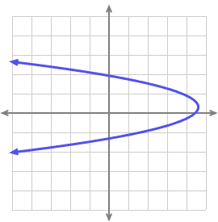
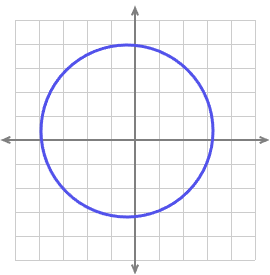
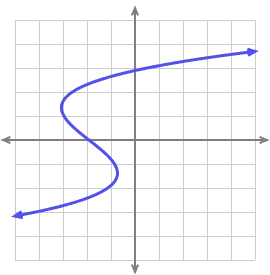
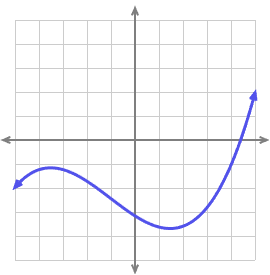

```{r setup, include=FALSE}
knitr::opts_chunk$set(echo = FALSE,warning=FALSE,message=FALSE,fig.align = 'center')

library(tidyverse)
```

*Answer the following questions to the best of your ability. Feel free to work with anyone in the cohort, though I would encourage attempting on your own first to make sure you fully understand the concepts.*

1) Which of these graphs depict functions and which do not?


A) 
```{r}

```

B)
```{r}

```

C)

```{r}

```

D)

```{r}

```


2) Find these limits:

a)

$$
\lim_{x\to -2^-}\frac{4x}{x+2}
$$

b) 

$$
\lim_{x\to 3}2^x
$$

3) Determine the value of $b$ to make $h(x)$ continuous at $x=-3$. Explain your reasoning using limits.

$$
h(x)=\begin{cases}
bx^2-\frac{3}{2}x-5 &x<-3 \\
-2x-9 &x\ge-3
\end{cases}
$$

4) Calculate the derivative of the following functions then evaluate at the given x:

a) $2x^2+4$ at $x=-3$

b) x^4-5x^3+x-5 at $x=5$

c) $\frac{5}{x^2}$ at $x=2$

\pagebreak

5) Find the slope of the tangent line in the graph below at $x=2$. Describe in words how the slope of the tangent line represents the derivative. Could the tangent line match another point on the curve?

```{r}
x=seq(-4,4,by=0.1)
y=0.5*x^2-1


ggplot()+
  geom_line(aes(x=x,y=y),color="black",linewidth=3)+
  annotate("segment",x=0,xend=4,y=-3,yend=5,color="red",linewidth=2)+
  theme_minimal()+
  scale_x_continuous(breaks=seq(-4,4,by=1))+
  scale_y_continuous(breaks=seq(-3,7,by=1))+
  theme(text=element_text(size=28))+
  labs(x="",y="")
  
```


