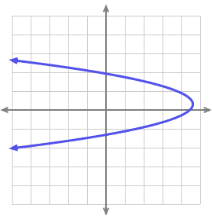
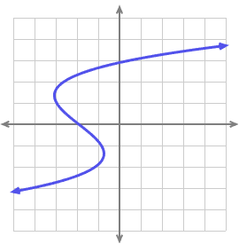

```{r setup, include=FALSE}
knitr::opts_chunk$set(echo = FALSE,warning=FALSE,message=FALSE,fig.align = 'center')

library(tidyverse)
```

*Answer the following questions to the best of your ability. Feel free to work with anyone in the cohort, though I would encourage attempting on your own first to make sure you fully understand the concepts.*

1) Which of these graphs depict functions and which do not?

\textcolor{blue}{Graphs A,B, and C all fail the vertical line test. Thus they are not functions. Graph D is a function because passes the vertical line test and thus is a function.}

A) 
```{r}

```

B)
```{r}
knitr::include_graphics("img/v_test2.png")
```

C)

```{r}

```

D)

```{r}
knitr::include_graphics("img/v_test4.png")
```


2) Find these limits:

a)

$$
\lim_{x\to -2^-}\frac{4x}{x+2}
$$

\textcolor{blue}{Evaluate the function from the left of ever closer values to infinty. We can see from the approximation below the limit approaches 2 from the left}

```{r}
x=c(-2.5,-2.1,-2.01,-2.001)
y=4*x/(x+2)

data.frame(x=x,y=y) %>% 
  t() %>% 
  knitr::kable()
```


b) 

$$
\lim_{x\to 3}2^x
$$

\textcolor{blue}{The table below shows that the limit approaches 8 at x=3 from both directions}

```{r}
x=c(2.5,2.9,2.99,2.999,3.001,3.01,3.1,3.5)
y=2^x

data.frame(x=x,y=y) %>% 
  t() %>% 
  knitr::kable()
```


3) Determine the value of $b$ to make $h(x)$ continuous at $x=-3$. Explain your reasoning using limits.

$$
h(x)=\begin{cases}
bx^2-\frac{3}{2}x-5 &x<-3 \\
-2x-9 &x\ge-3
\end{cases}
$$

\textcolor{blue}{This function is broken down into disparate pieces. To connect them an make them continuous we need both to approach the same value at x. Otherwise they will not converge. First we can evaluate the bottom part at x=3, then adjust b to get the top part to also equal that same value.}


\begin{align}
-2(-3)-9=-3\\
b(-3)^2-\frac{3}{2}(-3)-5=-3\\
9b+\frac{9}{2}=2\\
9b=\frac{-5}{2}\\
b=\frac{-5}{18}
\end{align}


4) Calculate the derivative of the following functions then evaluate at the given x:

a) $2x^2+4$ at $x=-3$


\begin{align}
2x^2+4\\
\frac{d}{dx}=4x\\
\frac{d}{dx(3)}=4(-3)=-12
\end{align}


b) $x^4-5x^3+x-5$ at $x=5$


\begin{align}
x^4-5x^3+x-5 \\
\frac{d}{dx}=4x^3-15x^2+1 \\
4(5)^3-15(5)^2+1=126
\end{align}


c) $\frac{5}{x^2}$ at $x=2$


\begin{align}
\frac{5}{x^2}\\
\frac{d}{dx}=-10x^{-3}\\
-10(2)^{-3}=1.25
\end{align}


\pagebreak

5) Find the slope of the tangent line in the graph below at $x=2$. Describe in words how the slope of the tangent line represents the derivative. Could the tangent line match another point on the curve?

```{r}
x=seq(-4,4,by=0.1)
y=0.5*x^2-1


ggplot()+
  geom_line(aes(x=x,y=y),color="black",linewidth=3)+
  annotate("segment",x=0,xend=4,y=-3,yend=5,color="red",linewidth=2)+
  theme_minimal()+
  scale_x_continuous(breaks=seq(-4,4,by=1))+
  scale_y_continuous(breaks=seq(-3,7,by=1))+
  theme(text=element_text(size=28))+
  labs(x="",y="")
  
```

\textcolor{blue}{Using rise over run we can take two points on the tangent line to find the slope. The tangent line provides the slope or instaneous rate of change at single point along the curve. Therefore the slope of the tangent line is the derivative. In this graph $\frac{dy}{dx}=2$ is unique at only x=2. However in other curves, such as sine waves or higher order polynomials, it is possible for different tangent lines to have the same slope}

$$
slope=\frac{1--1}{2-1}=\frac{2}{1}
$$
